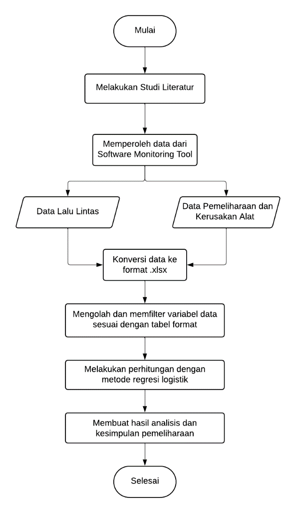
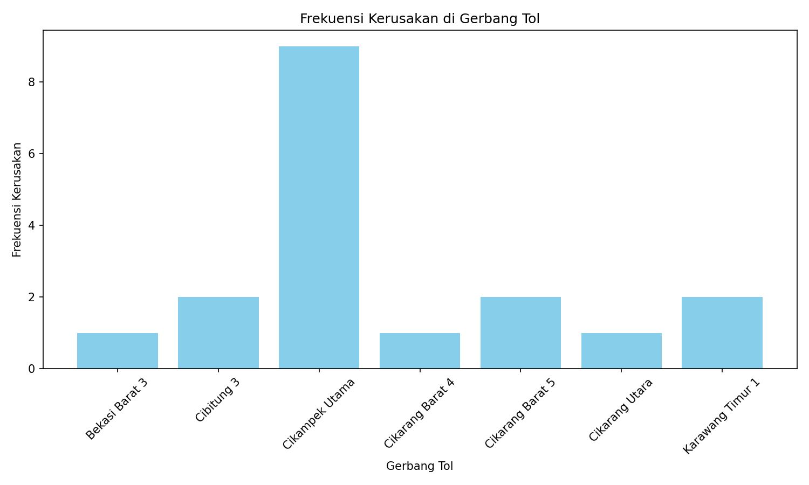
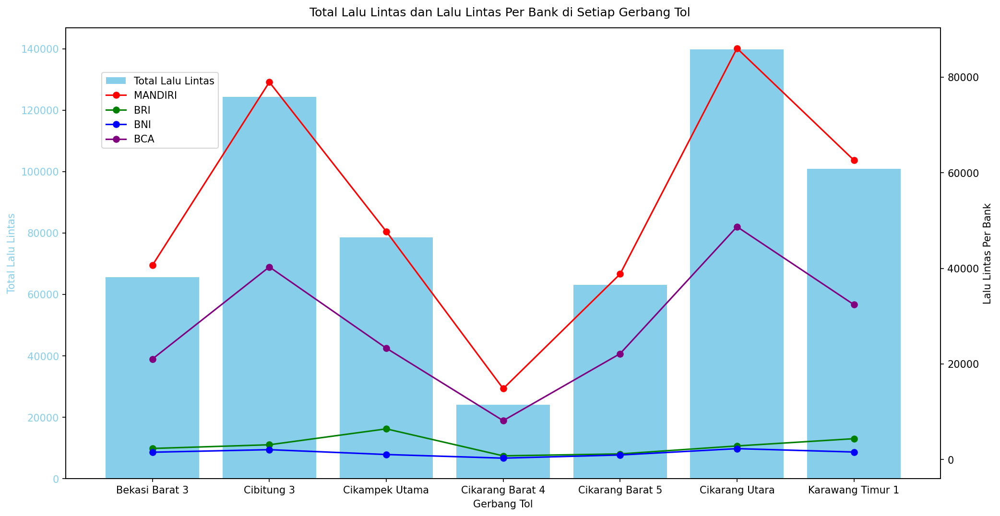

# Analisis Kerusakan Reader pada Sistem Gardu Tol Otomatis (GTO)
## Data Mining & Regresi Logistik untuk Pemeliharaan Proaktif (Python + Excel)

## Ringkasan Proyek
Proyek analisis data individu yang dikerjakan sembari magang industri di
sebuah perusahaan penyedia sistem gardu tol di Indonesia. Proyek ini
menggunakan data operasional nyata (lalu lintas harian & log
pemeliharaan/kerusakan alat) dari tujuh gerbang tol di ruas Jakarta-Cikampek
untuk mencari pola kerusakan pada *reader* — komponen pembaca kartu e-Toll
di Gardu Tol Otomatis (GTO) — dan menguji apakah volume lalu lintas
berhubungan dengan jenis tindakan perbaikan yang diperlukan.

## Kenapa Analisis Ini Diperlukan?
GTO bergantung penuh pada reader untuk membaca kartu e-Toll saat kendaraan
masuk/keluar gerbang. Ketika reader rusak, transaksi tol terganggu dan
berisiko menimbulkan antrean panjang. Selama ini penanganan kerusakan
reader cenderung **reaktif** — teknisi baru turun tangan setelah reader
benar-benar berhenti berfungsi. Pertanyaannya: apakah pola kerusakan ini
bisa dibaca lebih awal dari data operasional yang sudah rutin dikumpulkan
perusahaan (lalu lintas harian, log pemeliharaan), sehingga pemeliharaan
bisa bergeser dari reaktif menjadi **proaktif**?

## Data & Tools
**Data:** log pemeliharaan/kerusakan reader per gerbang (1–7 Februari 2024),
data lalu lintas harian per gerbang dipecah per bank penerbit e-Toll —
keduanya diambil dari software pemantauan operasional internal perusahaan
(Settlement Monitoring Tool) lalu dikonversi ke format tabel.

**Tools:** Python (`pandas`, `matplotlib`, `statsmodels`) di Google Colab
untuk visualisasi & pemodelan, Microsoft Excel untuk pembersihan data awal
dan cross-check hasil regresi.

## Alur Analisis
Data mentah dari dua sumber (lalu lintas & pemeliharaan) digabungkan,
difilter, dikonversi ke format biner untuk variabel kategorikal, lalu diuji
dengan regresi logistik.



## Hasil Visualisasi

**Frekuensi kerusakan per gerbang tol** — gerbang **Cikampek Utama**
mencatat 9 dari 18 total laporan kerusakan dalam seminggu, jauh di atas
gerbang lain (rata-rata 1–2 laporan). Ini konsisten dengan posisinya
sebagai titik pertemuan/transisi utama ruas tol.



**Total lalu lintas & distribusi bank e-Toll per gerbang** — gerbang dengan
volume lalu lintas tertinggi (Cikarang Utara, Cibitung 3) juga didominasi
transaksi Bank Mandiri, sejalan dengan pangsa kartu e-Toll di Indonesia.



## Analisis Mendalam: Menguji Ulang Model Regresi Logistik

Laporan awal menyimpulkan hasil regresi logistik dari Excel Regression
Add-in tanpa menjelaskan detail spesifikasi modelnya. Untuk memverifikasi
temuan tersebut, saya membangun ulang model yang sama di Python
(`statsmodels`) — dan proses reproduksi ini sendiri menghasilkan dua
temuan yang tidak eksplisit dinyatakan sebelumnya.

**1. Variabel target yang sebenarnya diprediksi bukan "jenis kerusakan",
melainkan "jenis tindakan perbaikan".**
Setelah menelusuri ulang tabel data gabungan, ternyata model regresi
memprediksi `tindakan` (0 = pengecekan alat, 1 = pergantian suku cadang)
menggunakan dua prediktor sekaligus: `total_lalu_lintas` dan `permasalahan`
(jenis kerusakan). Setelah spesifikasi ini dikoreksi, hasil reproduksi
di Python cocok hampir persis dengan angka pada laporan asli:

```python
X = df[["total_lalu_lintas", "permasalahan"]]
X = sm.add_constant(X)
y = df["tindakan"]
model = sm.Logit(y, X).fit()
```

| Variabel | Koefisien | Std. Error | Odds Ratio |
|---|---|---|---|
| Intercept | −7,6052 | 5,421 | 0,0005 |
| Total Lalu Lintas | 0,0001 | 0,000071 | ≈1,0001 |
| Permasalahan | −5,5802 | 3,557 | 0,0038 |

Kode lengkap ada di
[`code/03_regresi_logistik.py`](code/03_regresi_logistik.py).

**2. Uji signifikansi keseluruhan model justru signifikan, meski
masing-masing koefisien terlihat tidak signifikan.**
Uji rasio kemungkinan (*Likelihood Ratio test*) terhadap model secara
keseluruhan menghasilkan **p-value 0,0265** (signifikan pada α=5%),
padahal p-value tiap koefisien individual berada di atas 0,1. Ini indikasi
klasik adanya **hubungan antar-prediktor** (`total_lalu_lintas` dan
`permasalahan` sama-sama ikut menjelaskan variasi yang tumpang tindih),
yang membuat kontribusi masing-masing variabel secara sendiri sulit
dipisahkan dengan jumlah data sekecil ini.

**3. Variabel `total_lalu_lintas` ternyata hanya memiliki 8 nilai unik dari
18 observasi.**
Ini karena angka lalu lintas yang dipakai adalah **total mingguan per
gerbang** (bukan lalu lintas harian di hari insiden terjadi), sehingga
setiap insiden kerusakan pada gerbang yang sama otomatis mewarisi angka
lalu lintas yang identik. Akibatnya variasi X jauh lebih rendah dari
jumlah observasi yang terlihat, dan model secara implisit lebih banyak
membedakan "gerbang A vs gerbang B" ketimbang "hari sepi vs hari padat" —
sebuah keterbatasan yang tidak disebutkan pada laporan awal.

## Keterbatasan Data

Analisis ini bersifat eksploratif, bukan konfirmatori, karena:

- **Rentang data hanya 1 minggu** (18 laporan kerusakan), terlalu kecil
  untuk regresi logistik dua-prediktor menghasilkan estimasi yang stabil
  (interval kepercayaan sangat lebar, lihat tabel di atas).
- **Granularitas lalu lintas per-minggu, bukan per-hari**, seperti
  dijelaskan pada temuan #3 di atas.
- **Tidak ada data validasi/hold-out** — model dilatih dan diuji pada
  dataset yang sama, sehingga tidak ada ukuran seberapa baik model
  digeneralisasi ke data baru.

Kalau data lalu lintas harian per-gerbang (bukan agregat mingguan) dan
rentang waktu observasi yang lebih panjang (misalnya 3–6 bulan) tersedia,
model ini punya potensi jauh lebih kuat untuk dijadikan dasar keputusan
pemeliharaan proaktif — bukan sekadar sekadar deskriptif.

## Kesimpulan
Pola deskriptif cukup jelas: kerusakan reader terkonsentrasi di gerbang
dengan lalu lintas tinggi, dan penyebab paling umum adalah kegagalan
membaca kartu (SAM/antena) serta kegagalan daya (PSU). Namun secara
statistik, hubungan antara volume lalu lintas dan jenis tindakan
perbaikan **belum bisa disimpulkan secara meyakinkan** dengan data yang
tersedia — bukan karena metodenya salah, tapi karena volume dan
granularitas datanya belum cukup. Reproduksi model di atas justru berguna
untuk menunjukkan dengan tepat *di mana* keterbatasannya, sehingga
rekomendasi pemeliharaan proaktif pada proyek ini (inspeksi rutin slot
SAM & antena, monitoring power supply, penjadwalan penggantian suku
cadang) tetap didasarkan pada pola deskriptif yang teramati, bukan model
prediktif yang belum teruji kuat.

## Skill yang Didemonstrasikan
- Data mining & regresi logistik untuk data biner (interpretasi koefisien,
  odds ratio, p-value, uji rasio kemungkinan)
- Reproduksi & verifikasi hasil analisis lintas tools (Excel → Python)
  untuk memastikan konsistensi metodologi
- Diagnostik kritis terhadap kualitas data (granularitas variabel,
  ukuran sampel, multikolinearitas implisit)
- Pemrograman Python untuk analisis data: `pandas`, `matplotlib`
  (visualisasi dual-axis), `statsmodels` (pemodelan statistik)
- Pengolahan & pembersihan data operasional mentah menjadi dataset
  siap-analisis
- Fisika instrumentasi diterapkan pada industri: prinsip kerja sensor
  NFC/RFID pada reader dan sistem kelistrikan (PSU, relay, MCB) pada
  perangkat GTO
- Komunikasi hasil analisis teknis menjadi rekomendasi yang dapat
  ditindaklanjuti tim operasional

## Struktur Repository
```
├── README.md
├── code/
│   ├── 01_chart_frekuensi_kerusakan.py
│   ├── 02_chart_lalu_lintas_bank.py
│   └── 03_regresi_logistik.py
├── data/
│   ├── tabel_pemeliharaan_kerusakan_reader.csv
│   ├── tabel_lalu_lintas_per_bank.csv
│   └── tabel_gabungan_regresi_logistik.csv
├── images/
│   ├── diagram_alir_metode_penelitian.png
│   ├── regenerated_chart_frekuensi_kerusakan.png
│   ├── regenerated_chart_lalu_lintas_bank.png
│   ├── original_chart_frekuensi_kerusakan.png
│   ├── original_chart_lalu_lintas_bank.png
│   ├── original_chart_trendline_regresi.png
│   ├── original_tabel_regresi_excel.png
│   ├── original_output_logit_python.png
│   ├── alat_lts_gto.jpg
│   ├── reader_pada_gto.jpg
│   ├── nfc_tag_dan_reader.jpg
│   ├── gardu_tol_otomatis.jpg
│   ├── toll_fare_information.jpg
│   ├── etoll_card.jpg
│   ├── peta_ruas_tol_jakarta_cikampek.jpg
│   ├── settlement_monitoring_tool.jpg
│   ├── penyolderan_keyboard.jpg
│   ├── dokumentasi_solder.jpg
│   ├── dokumentasi_pengujian_layar.jpg
│   └── dokumentasi_pcb_akhir.jpg
└── docs/
    └── laporan_teknis_analisis_reader_gto.pdf
```

## Referensi
- Amalia, G. P. (2017). *Efektivitas Electronic Toll (E-Toll) Oleh PT. Jasa Marga Surabaya*. Publika.
- Bharambe, S., Kumbhar, P., Patil, P., & Sawant, K. (2016). *Automated Toll Collection System Using NFC And Theft Vehicle Detection*. International Journal of Engineering And Computer Science.
- Hendayana, R. (2013). *Application Method of Logistic Regression to Analyze the Agricultural Technology Adoption*. Informatika Pertanian.
- Sufanir, A. M. S. (2017). *Efektivitas Gardu Tol Otomatis (GTO) Buah Batu Ditinjau dari Kecepatan Transaksi Rata-Rata*. Simposium II UNIID.
- Varalakshmi, M. I., Abishek, M. D., Suriya, M. K. A., & BT, M. H. (2020). *Smartpay – Unified Payment System Using NFC*.
- Yudissanta, A., & Ratna, M. (2012). *Analisis pemakaian kemoterapi pada kasus kanker payudara dengan menggunakan metode regresi logistik multinomial*. Jurnal Sains dan Seni ITS.
